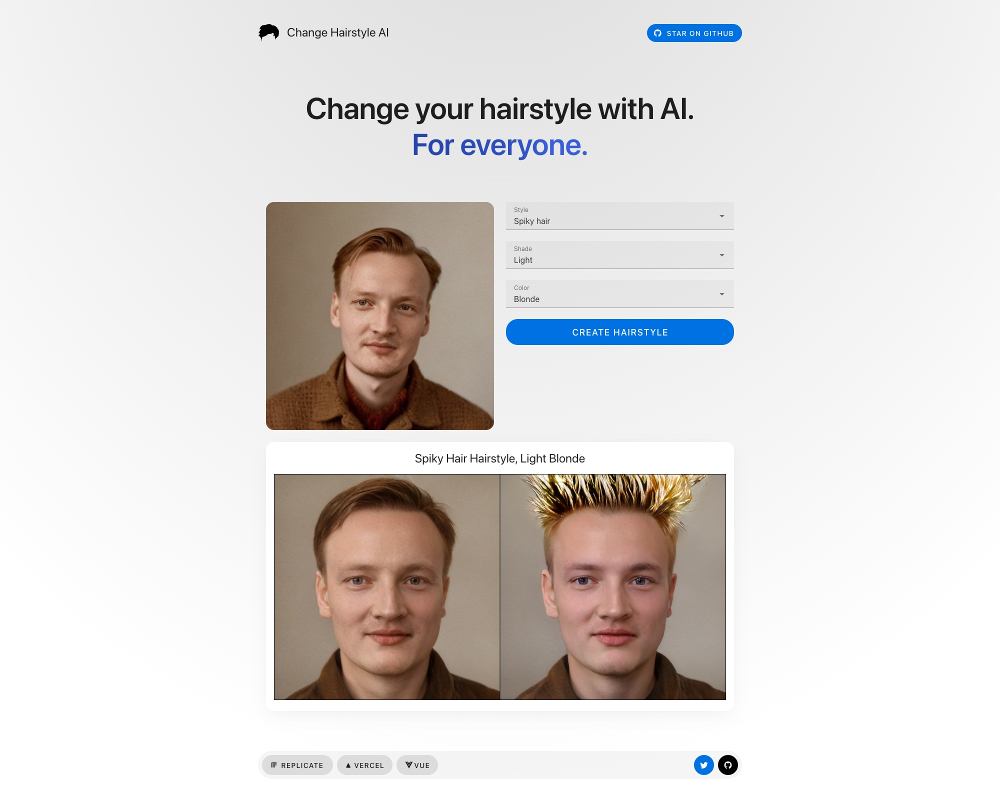

# [ChangeHaristyleAI.com](https://changehairstyleai.com)

[](https://changehairstyelai.com)

## How it works

This app is powered by:

🚀 [Replicate](https://replicate.com/?utm_source=github&utm_campaign=changehairstyleai), a platform for running machine learning models in the cloud.

✂ [HairCLIP](https://replicate.com/wty-ustc/hairclip?utm_source=github&utm_campaign=changehairstyleai), an open-source machine learning model that generates images of hairstyles by text and a reference image.

▲ [Vercel](https://vercel.com/), a platform for running web apps.

⚡️ Nuxt.js [server-side API handlers](server/api), for talking to the Replicate API.

📦 [Vuetify](https://vuetifyjs.com/en/), a Vue.js component framework for the browser UI.

## Run it yourself

You need a [Replicate API token](https://replicate.com/account?utm_source=github&utm_campaign=changehairstyleai) (and optionally an [Upload.io public API key](https://upload.io/dashboard/security/api_keys)). Copy the contents of [.example.env](.example.env) into a new file in the root of your directory called `.env` and insert the API key(s) there, like this:

```bash
# Get your Replicate API token at https://www.replicate.com/account
NUXT_REPLICATE_API_TOKEN=<put your token here>

# Optional, if you're planning to use Upload.io.
NUXT_PUBLIC_UPLOAD_API_KEY=<put your key here>
```

Then, install the dependencies and run the local development server:

```bash
npm install
npm run dev
```

Open http://localhost:3000 in your web browser. Done!

## One-click deploy

Deploy this project using [Vercel](https://vercel.com?utm_source=github&utm_medium=readme&utm_campaign=changehairstyleai):

[](https://vercel.com/new/clone?repository-url=https://github.com/Pwntus/change-hairstyle-ai&env=NUXT_REPLICATE_API_TOKEN&project-name=change-hairstyle-ai&repo-name=change-hairstyle-ai)
